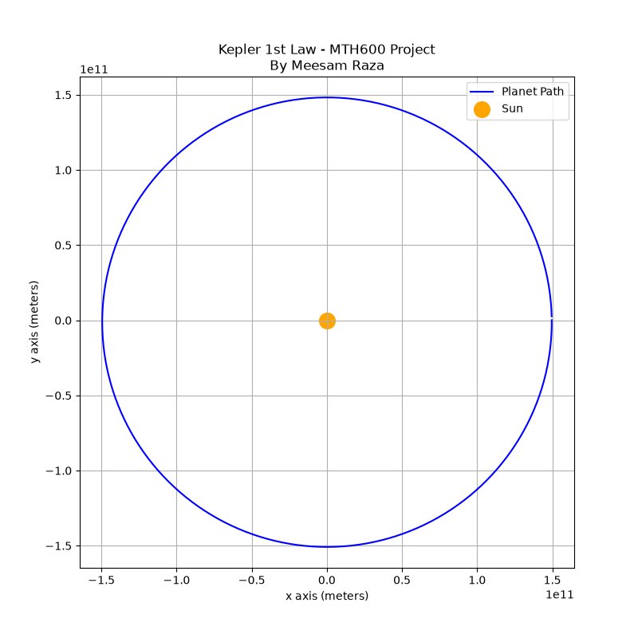
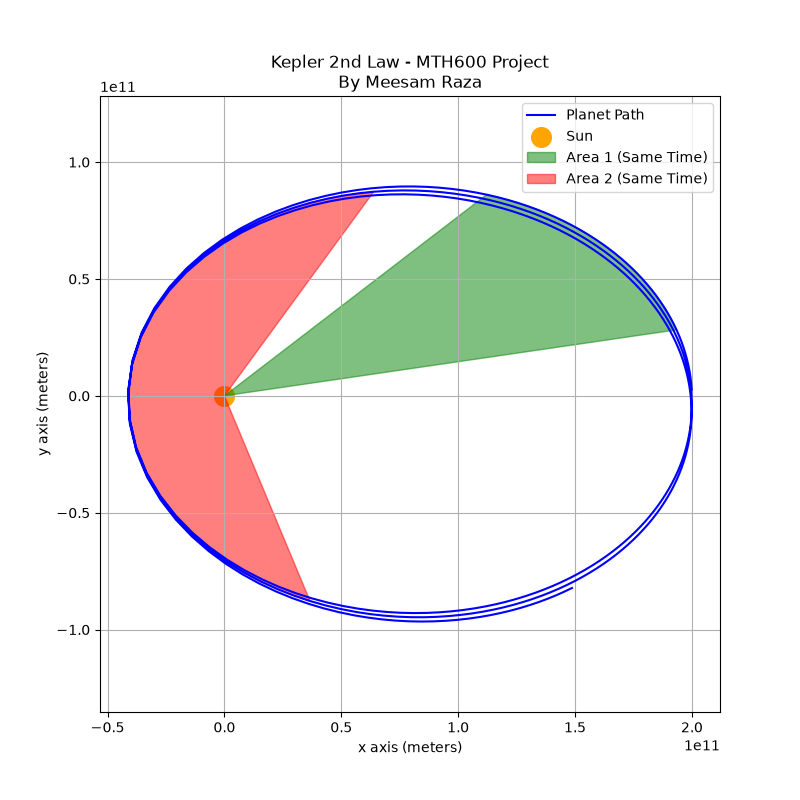
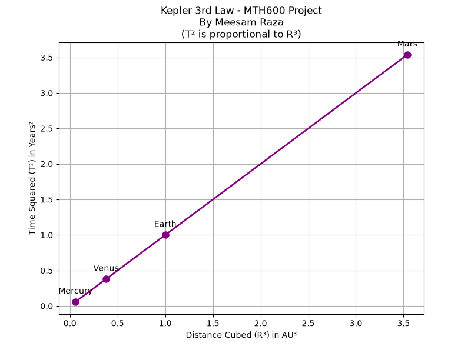

# Kepler's Laws of Planetary Motion (Final Year Project, MTH600)

**Author:** Meesam Raza, BS Mathematics, Virtual University of Pakistan.

Because my major is Math, I wanted to apply the mathematics of gravity in computer code and see how orbits work. In this project, Python is used to demonstrate Kepler's three laws of planetary motion.

Parts 1 and 2 solve Newton's law of gravity numerically (no orbit shape is assumed beforehand). Part 3 tests the law of harmonies with real orbital data.

## Method (Parts 1 and 2)

The Sun is fixed at the origin and the planet moves in a plane under the gravitational acceleration

a = -G M r / |r|³

The equations of motion are integrated with the **velocity Verlet method** (second order) with a time step of **1 hour**, for exactly one orbital period. All values are in SI units (G = 6.67430e-11 m³ kg⁻¹ s⁻², M = 1.989e30 kg).

---

## Part 1: Kepler's First Law (Law of Ellipses)

**File:** `keplers_1st_law.py`

A planet moves on an ellipse with the Sun at one focus. Mercury is started at perihelion (4.6001e10 m from the Sun, 58,980 m/s, perpendicular to the radius) and simulated for one orbit. Mercury is used because its orbit (e ≈ 0.21) is clearly not a circle.

The simulated path is compared with the exact ellipse r(θ) = p / (1 + e cos θ), where p and e follow from the starting values.

| Quantity | Result |
|---|---|
| Semi-major axis a | 5.7893e10 m |
| Eccentricity e | 0.2054 (theory) and 0.2054 (from simulated r_min and r_max) |
| Period | 87.92 days |
| Maximum difference between simulation and exact ellipse | 0.0007 % |



*Blue: simulated path. Red dashed: exact ellipse. The Sun sits at one focus; the other focus is empty.*

---

## Part 2: Kepler's Second Law (Law of Equal Areas)

**File:** `keplers_2nd_law.py`

The line from the Sun to the planet sweeps out equal areas in equal times. A planet is started at its far point (2.0e11 m from the Sun, 15,000 m/s) and simulated for one orbit (263.7 days). The area swept in two time windows of **20 days each** is calculated with the shoelace formula: one window starts at the far point, the other is centred on the close point.

| Quantity | Result |
|---|---|
| Area 1 (far, slow) | 2.5920e21 m² |
| Area 2 (close, fast) | 2.5920e21 m² |
| Speed at far point / close point | 15,000 m/s / 73,501 m/s (4.90 times faster) |
| Distance far / close | 4.90 |

The planet is 4.90 times faster at the close point because it is 4.90 times closer, as expected from conservation of angular momentum.



*Green: area swept in 20 days near the far point. Red: area swept in 20 days near the close point.*

**Note:** for any central force, a scheme like velocity Verlet keeps the angular momentum constant, so equal areas are reproduced by construction. This result is therefore a consistency check of the code and an illustration of the law, not an independent test of gravity.

---

## Part 3: Kepler's Third Law (Law of Harmonies)

**File:** `keplers_3rd_law.py`

The square of the orbital period is proportional to the cube of the mean distance from the Sun (T² ∝ R³). With R in astronomical units (AU) and T in years, the constant of proportionality is 1. The law is tested with data of Mercury, Venus, Earth and Mars.

| Planet | R (AU) | T (years) | T² / R³ |
|---|---|---|---|
| Mercury | 0.387 | 0.241 | 1.0021 |
| Venus | 0.723 | 0.615 | 1.0008 |
| Earth | 1.000 | 1.000 | 1.0000 |
| Mars | 1.524 | 1.881 | 0.9996 |

- Straight-line fit: T² = 0.9995 R³ + 0.0004, with R² = 1.000000.
- Log-log fit: T ∝ R^p with p = 1.4991 (Kepler: p = 1.5).



*Left: T² against R³ with the fitted line. Right: log-log plot, whose slope should be 1.5.*

---

## Relevance to nuclear reactor physics

This project is not a neutron transport calculation, but it builds numerical skills that reactor physics codes rely on:

- **Time integration of differential equations.** Reactor analysis uses the same kind of ODE solvers, for example for point reactor kinetics and fuel depletion (Bateman equations). The choice of method and time step controls the accuracy, as the time step and conservation checks in Parts 1 and 2 show.
- **Verification against exact solutions and conserved quantities.** The simulated orbit is checked against the exact ellipse and against conservation of angular momentum. Nuclear codes are verified in the same way, against analytical benchmarks and balance (conservation) checks.
- **Inverse-square central force.** The Kepler problem has the same mathematical form as the Coulomb force, so the same code can describe Rutherford scattering of a charged particle by a nucleus (hyperbolic instead of elliptical orbits).
- **Two kinds of numerical error.** Here the error is deterministic and shrinks as the time step is reduced. In Monte Carlo codes such as OpenMC ([see my Nuclear-Reactor-Simulations repository](https://github.com/meesam-scientific/Nuclear-Reactor-Simulations)) the error is statistical and shrinks roughly as 1/sqrt(N) with the number of neutron histories.

## How to run

```bash
pip install numpy matplotlib
python keplers_1st_law.py
python keplers_2nd_law.py
python keplers_3rd_law.py
```

Each script prints its results and saves its picture in the current folder.

## Limitations

- The Sun is fixed at the origin and the planet's own mass is neglected.
- The motion is two-dimensional and includes only the Sun's gravity (no other planets, no relativistic effects such as the precession of Mercury's perihelion).
- Parts 1 and 2 use different starting orbits (Mercury and a planet with a more eccentric orbit) to make the shapes easy to see.
- Part 3 uses rounded tabulated orbital data, not simulated periods.

## Files

| File | Content |
|---|---|
| `keplers_1st_law.py` | Simulation of one orbit and comparison with the exact ellipse |
| `keplers_2nd_law.py` | Simulation of one orbit and calculation of the swept areas |
| `keplers_3rd_law.py` | T² against R³ and log-log fit with planet data |
| `*_plot.png` | Pictures produced by the scripts |
